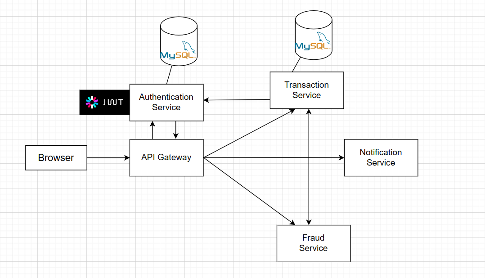

# MiniCoreBankingSystem

MiniCoreBankingSystem is a banking system built using Spring Framework. This project consists of an API Gateway and four microservices that provide various functionalities for the banking system: authentication, transaction, notification, and fraud.

  

 
